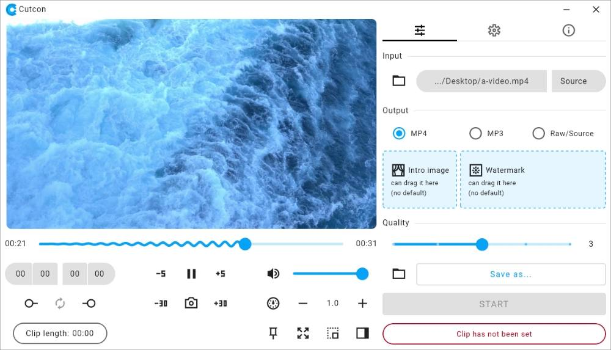

  <picture>
    <source media="(prefers-color-scheme: dark)" srcset="raw/demo-dark.jpg">
    <source media="(prefers-color-scheme: light)" srcset="raw/demo-light.jpg">
    
  </picture>

#  Cutcon
Cross-platform app to cut/trim, convert/re-encode, and play/view media files (video, audio, image).  
Free and open source.

With ability to generate lossless (raw) and lossy output.  
Supports adding watermark (overlay) and start image (intro) to MP4 output and artwork (album art) to MP3 output.

Derived from another private project called Clipper.

## Supported platforms

The app is supported on Windows x64, common Linux x64 distros and also experimentally on macOS.

## Download
See the bottom section of the [release page](https://github.com/mahozad/cutcon/releases).

## The name
In addition to being a merge of the words **cut** and **con**vert,
it is also a Persian/Farsi name, meaning literally, *do the cut*.

## The logo
Represents the two *C* letters in the name.

## Similar and alternative apps
  - LosslessCut: https://github.com/mifi/lossless-cut
  - simple-video-cutter: https://github.com/bartekmotyl/simple-video-cutter
  - HandBrake: https://github.com/HandBrake/HandBrake
  - VidCutter: https://github.com/ozmartian/vidcutter
  - Shotcut: https://github.com/mltframework/shotcut
  - OpenCut: https://github.com/OpenCut-app/OpenCut
  - CapCut: https://www.capcut.com/
  - Olive: https://github.com/olive-editor/olive
  - Avidemux2: https://github.com/mean00/avidemux2
  - Videomass: https://github.com/jeanslack/Videomass
  - VidCoder: https://github.com/RandomEngy/VidCoder
