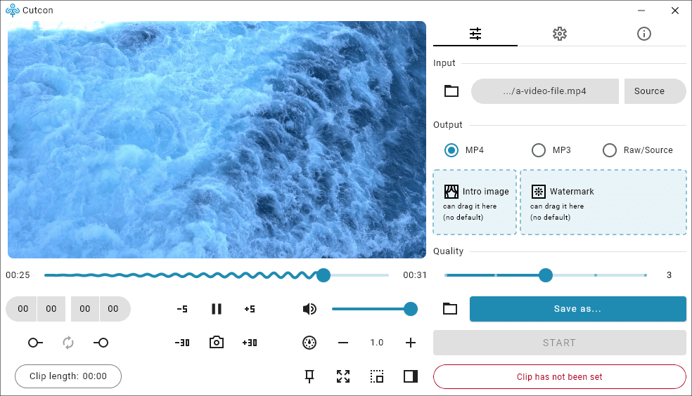

  <picture>
    <source media="(prefers-color-scheme: dark)" srcset="raw/demo-dark.png">
    <source media="(prefers-color-scheme: light)" srcset="raw/demo-light.png">
    
  </picture>

#  Cutcon
Cut, convert, and view media files (video, audio, image). Free and open source.

With ability to generate lossless (raw) and lossy output.  
Supports adding watermark (overlay) and start image (intro) to MP4 output and artwork (album art) to MP3 output.

Currently, only Windows is supported.  
Support for Linux will come soon.

## Download
See the bottom section of the [release page](https://github.com/mahozad/cutcon/releases).

## The name
In addition to being a merge of the words **cut** and **con**vert,
it is also a Persian/Farsi name, meaning literally, *do the cut*.

## The logo
Represents the capitalized name of the app, **CUTCON**.

## Similar apps
  - LosslessCut: https://github.com/mifi/lossless-cut
  - simple-video-cutter: https://github.com/bartekmotyl/simple-video-cutter
  - VidCutter: https://github.com/ozmartian/vidcutter
  - Shotcut: https://github.com/mltframework/shotcut
  - Olive: https://github.com/olive-editor/olive
